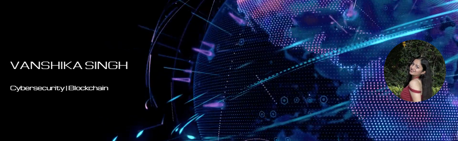

<h1 align="center">Hey, I'm Vanshika Singh! </h1>

  

---

## A little about me

- Computer Science undergrad at Jaypee University of Information Technology (Batch of 2026)
- Cybersecurity, Blockchain Enthusiast
- Pattern Recognition & Economic Threat Analysis Researcher
- Currently exploring real-time systems and smart contracts
- And I love formula 1!

---

## Projects I'm Proud Of

### Cryptocurrency Matching Engine – Investment Logic Simulation
**Tech:** Python, FastAPI, WebSockets, Pydantic  
Simulated a high-frequency order book matching engine supporting Market, Limit, IOC, FOK orders. Processed 1000+ orders/sec with sub-10ms latency. Modeled volatility and stress testing under financial shocks.

### Dark Web Threat Intelligence for Economic Risk Analysis
**Tech:** Python, Scapy, Tor, BeautifulSoup  
Scraped and scanned 200+ onion domains to detect early financial cybercrime indicators (e.g., ransomware ops, crypto fraud). Quantified macroeconomic implications of threat patterns.

### Decentralised E-Vault using Blockchain (SIH Rank 5)
**Tech:** Solidity, Web3.js, Node.js  
Developed immutable legal document storage with access verification smart contracts. Aligned with regulatory and adoption feasibility studies.

---

<table>
  <tr>
    <th>Languages</th>
    <td>
      
      
      
      
      
      
      
    </td>
  </tr>
  <tr>
    <th>Frameworks & Libraries</th>
    <td>
      
      
      
      
    </td>
  </tr>
  <tr>
    <th>Platforms & Technologies</th>
    <td>
      
      
      
    </td>
  </tr>
  <tr>
    <th>Developer Tools</th>
    <td>
      
      
      
      
      
    </td>
  </tr>
</table>

---

## 📈 GitHub Stats

  

---

## Some of my Achievements & Certifications

- Finalist (Top 3%) – Google Girl Hackathon 2024 (5500+ participants)
- Goldman Sachs Software Engineering Virtual Internship – Forage
- Smart India Hackathon 2024 – Secured **All-India Rank 5**

## Contact 📫

Feel free to reach out to me via email at **singhvanshikaq@gmail.com**

## Find Me on LinkedIn 🌐

Let’s connect on [**LinkedIn**](https://www.linkedin.com/in/vanshikasinghq/) and explore opportunities, collaborations, or just say hi!

---

<i>“Break rules, and invent.”</i>

